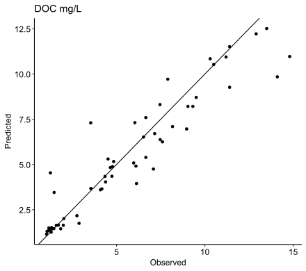

```{r setup, include=FALSE}
knitr::opts_chunk$set(echo = TRUE)
```

# IMPORTANT MESSAGE (UPDATE)

(New) For better access **moved the ADDRESS project folder** that contains all data relevant for modelling **to Biogeochemie zfs1 server**. zfs1/.../hydropedo/projects/ADDRESS -\> zfs1/.../fak3biogeochemie/03 Projects - Projekte/ADDRESS/ADDRESS:

In zfs1/.../hydropedo/projects/ADDRESS, there is now a shortcut linking to the new location for easier access from the soil team side.

-   /GIS -\> zfs1/.../fak3biogeochemie/projects/ADDRESS/

-   /data -\> zfs1/.../fak3biogeochemie/projects/ADDRESS/

-   /models -\> zfs1/.../fak3biogeochemie/projects/ADDRESS/

-   /R_main

    -   -\> gitlab.hrz.tu-chemnitz.de/sa56kotu-at-tu-freiberg-de/ADDRESS (no longer maintained, I will not have access after my university contract concludes)

    -   UPDATE: migrated to -\> gitlab.hrz.tu-chemnitz.de/seanadamhdh/address as public repo\

# ADDRESS data exchange and online repository

This repository serves as a platform for code exchange and its collaborative developement for the ADDRESS project.

## GENERAL UPLOAD RULES / GUIDELINES

Please do not directly upload to /main. Generally stable additions and clean data can be added to /work_in_progress. Unstable scripts /messy data should be commited to seperate (new) branch first to avoid contamination of main repository. Folder structure:

-   R_main\
    Contails all scripts. Clean / working scripts stored directly. This is the only folder that is pushed to github.

    -   temp\
        Working output directory. Plots, model outputs etc. should be saved here initially.

    -   other folders\
        For saving / dumping uncleaned scripts.

--- Moved to f./fak3/biogeochemie/projects/ADDRESS/

-   models\
    Clean, chekced and evaluated model outputs.

-   data\
    Raw data and compiled datasets

    -   raw\
        Store raw data from the lab or the spectrolyzers here.

    -   processed\
        Consolidated datasets and other data products.

## Spectral processing and model calibration

Chemometric models were calibrated from UV-Vis scans ("/data/processed/allspecoriginal_Oct2023.xlsx") and corresponding anlytical data ("/data/Autosampler_A12_clean.csv") to predict various properties, i.e., DOC and trace element concentrations, from in situ Spectrolyzer data.

### Spectral processing

UV-Vis spectra were recorded from 200 to 720 nm at a resolution of 0.5 nm. Raw spectra were cleaned by removing implausible scans (absorbance \< 0 or absorbance \> 4.5). Spectra were processed using the prospectr package @stevens2022. First, spectra were smoothed using a Savitzky Golay filter with a polynomial degree of 3 and a window size of 11 to remove noise. Then, a Standard Normal Variate (SNV) correction was applied. Both raw, smoothed and smoothed + snv-corrected spectra were used for model calibration.

### Model calibration

Chemometric models were calibrated using the Cubist package @kuhn2023 in the caret framework @kuhn2008 for the following variables: EC, pH, doc_mgL, dic_mgL, Sr, Suva254, Mn_mgL, Ni_mgL, As_mgL, Cd_mgL, Pb_mgL, Fe_mgL, Al_mgL, Cu_mgL, Zn_mgL, and Durchfluss. Models were calibrated both for untransformed and log1p-transformed variables, and using the three differently processed spectral sets (raw, smoothed, smoothed+snv). Cubist models were tuned for 1, 2, 5, 10, 20, and 50 committees and 0-9 neighbours using a 10-fold cross-validation. 75 % of the dataset was used for calibration and 25 % was held back for testing. The dataset was split using random, percentile-binned sampling. Model accuracy was evaluated using the test set, using a modified version of the evaluate_model() function found in the simplerspec package @baumann2020 to calculate RMSE, R2, RPD, and Lin's concordance correlation coefficient among other valuation statistics. An example for the predictions for the test set can be seen in the figure below for DOC.



Full evaluation summary: "//zfs1.hrz.tu-freiberg.de/fak3biogeochemie/03 Projects - Projekte/ADDRESS/ADDRESS/models/Cubist_2024_02_21_eval.csv"

# Literature
